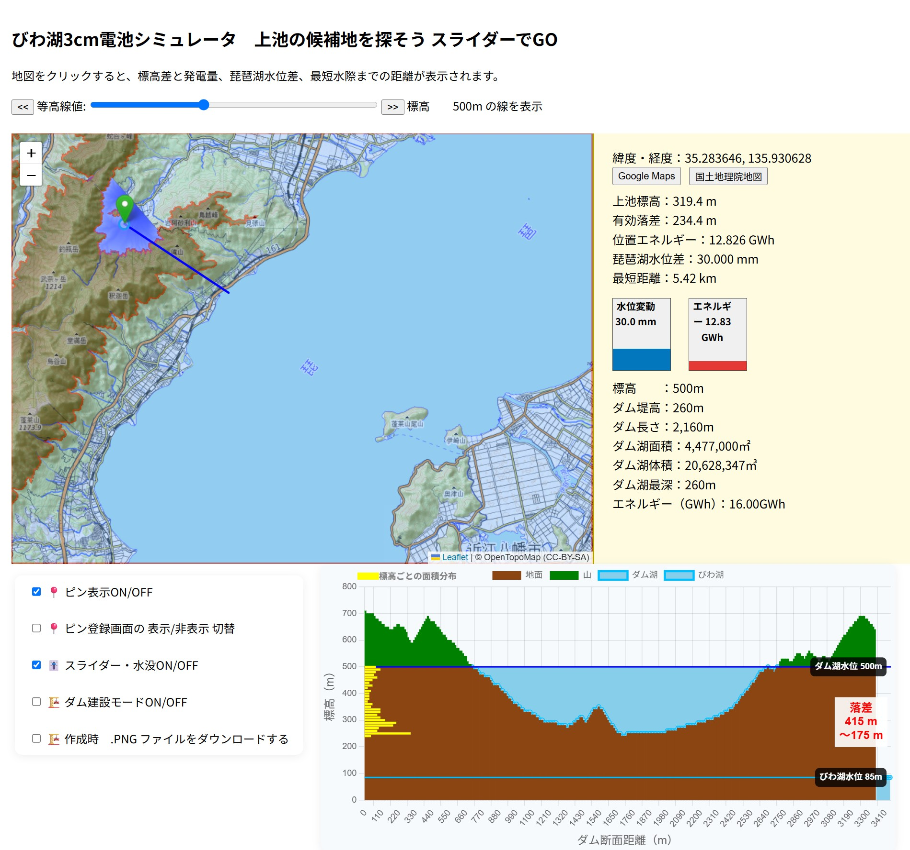

# びわ湖3cm電池シミュレータ

## 🌊 これは何？

このツールは、びわ湖の水位をたった **3cm** 上げる（または下げる）ことで、
どれだけの揚水発電エネルギーが得られるかを**地図上で直感的に体験できる可視化ツール**です。

地図をクリックするだけで：

- その地点の標高（国土地理院APIから取得）
- 有効落差（びわ湖標高を基準）
- 揚水量 2,010万トン（3cm換算）による位置エネルギー（GWh）
- びわ湖水位差（mm）
- 最寄りのびわ湖水際点までの直線距離（km）

を自動計算・グラフ化します。

## 📦 内容物

- `index.html` : 地図とシミュレータ本体
- `images/` : スクリーンショット等（任意）
- `README.md` : この説明ファイル

## 📐 技術情報

- 地図：Leaflet.js + OpenTopoMap
- 標高取得：国土地理院 DEM API
- 琵琶湖水位基準：85.0 m（仮定）
- 揚水量：20,100,000 m³（= 琵琶湖3cm水位相当）
- エネルギー換算：E = m × g × h / 3.6e12 → [GWh]

## 🌍 実際に動かしてみる（GitHub Pages）

👉 [びわ湖電池シミュレーターを見る](https://pgmatsuyama.github.io/biwako-3cm-energy/)

※お好きな場所をクリックして、あなたのダム構想を作ってみてください！---
## 📱 スマホでアクセスするには

## 🧭 使い方

1. `index.html` をブラウザで開く
2. 地図上で上池候補地点をクリック
3. エネルギー量と水位差を確認

## ✨ ライセンス

MIT License

## 🙋‍♂️ 作者

- GitHub: [pgmatsuyama](https://github.com/pgmatsuyama)
- プロトタイピング・サイエンスツール制作協力：ChatGPT

## 💡 こんな使い方に

- 再生可能エネルギー教育・展示
- ダムや揚水発電の理解促進
- 地元資源を活用した構想検討
- 「びわ湖の3cmで原発1基分の電力」が直感で伝わる！

ぜひ「びわ湖電池」の可能性を、クリックと数字で体験してください。
